# 因子分析报告: ID_40

**分析日期**: 2026-06-28 | **因子类型**: InformationDiscreteness

> 本报告评估因子 `ID_40` 在 407 个标的上（2015-01-30 ~ 2026-06-25）的表现。每个指标均附带「怎么算的」和「代表什么」解读。

## 数据概况

| 项目 | 数值 |
|---|---|
| 有效标的数 | 407 |
| 有效日期数 | 2768 |
| 日期范围 | 2015-01-30 ~ 2026-06-25 |
| 均值覆盖率 | 46.52% |
| 加载失败 | 0 个 |
| min_bars 过滤 | 74 个 |

> **怎么算的**: 均值覆盖率 = 每天有有效因子值的标的数 / 总标的数，再对所有交易日取平均。> 它回答了因子计算有没有系统性缺失——如果某天覆盖率骤降，说明数据源出了 bug 或大量标的进入 warmup 期。

## Layer 1: 因子质量

> **本层定位**: 只看因子自身，不涉及未来收益。回答「这个因子本身是否健康可用」。

### 1.1 覆盖率

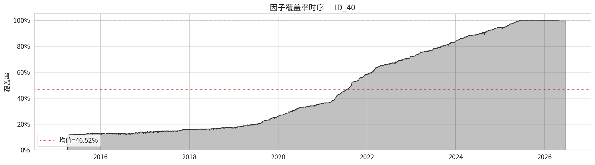

> **怎么算的**: 每个交易日统计「有有效因子值的标的数 ÷ 总标的数」，画成时间序列。
> **代表什么**: 覆盖率随时间骤降 = 因子计算有 bug 或数据源退化。覆盖面过窄（如 < 30%）的因子无法做截面比较。

### 1.2 全样本分布统计

| 指标 | 值 |
|---|---|
| mean | 0.544976 |
| std | 0.081427 |
| skewness | -0.120075 |
| kurtosis | 0.274799 |
| min | 0.075000 |
| p01 | 0.350000 |
| p05 | 0.400000 |
| p25 | 0.500000 |
| p50 | 0.550000 |
| p75 | 0.600000 |
| p95 | 0.675000 |
| p99 | 0.725000 |
| max | 0.900000 |

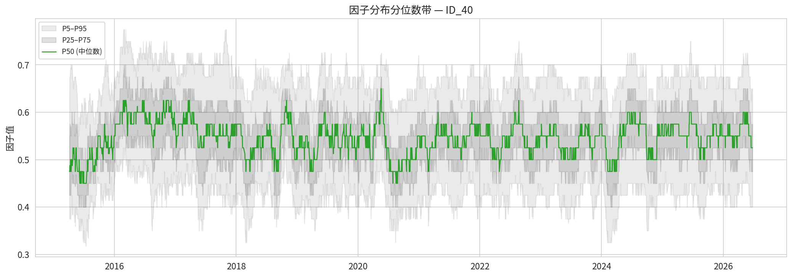

> **怎么算的**: 把所有标的、所有交易日的因子值混在一起，算均值/标准差/偏度/峰度/各分位数。图上是每天截面上的 P5/P25/P50/P75/P95 分位数随时间的变化。
> **代表什么**: 偏度接近 0，分布大致对称。 峰度接近 0（近似正态），极端值不频繁。 P1=0.3500 到 P99=0.7250 覆盖了 98% 的因子值范围。极端偏态分布的因子不适合用 Pearson IC 评估（Spearman 更健壮）。

### 1.3 缺失模式分析

**按成交额分档**:

| 分档 | 缺失率 |
|---|---|
| 低成交额 | 50.5451% |
| 中成交额 | 56.3233% |
| 高成交额 | 53.5893% |

**按上市时长 (bar_count) 分档**:

| 分档 | 缺失率 |
|---|---|
| 短上市 | 78.1385% |
| 中上市 | 57.8061% |
| 长上市 | 24.5240% |

> **怎么算的**: 按标的的属性（日均成交额 / 有效交易日数）将它们分成 3 档，统计每档内因子 NaN 的比例。
> **代表什么**: 如果缺失率在不同档次间差异很大（如低成交额 ETF 缺失率显著更高），说明因子在截面上系统性地偏向某一类标的，存在隐性偏差。

### 1.4 自相关衰减

| 滞后 (天) | 均值自相关 | 中位数自相关 | 标准差 |
|---|---|---|---|
| 1 | 0.9674 | 0.9688 | 0.0107 |
| 5 | 0.8448 | 0.8487 | 0.0419 |
| 10 | 0.7057 | 0.7143 | 0.0712 |
| 20 | 0.4487 | 0.4598 | 0.1090 |

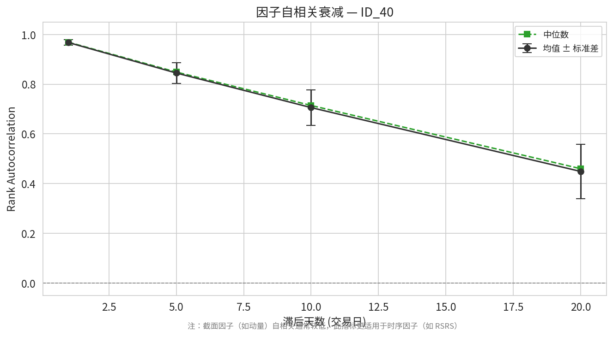

> **怎么算的**: 对每个标的，计算 factor(t) 和 factor(t−lag) 的 Spearman 秩相关系数，取所有标的的截面均值和中位数。中位数比均值更稳健，不受少数极端标的影响。
> **代表什么**: lag1 中位数=0.97，说明一半以上标的今天的因子值和昨天几乎一样（自相关=97%）。 lag20=0.46，即使隔一个月仍有46%相关性——因子变化缓慢，调仓频率不需要太高（如日频调仓意义不大，周频或月频更合理）。

## Layer 2: 预测力

> **本层定位**: 核心。回答「这个因子能否预测未来收益」——这是评估因子价值最关键的部分。

### 2.1 各持仓期 IC

| 持仓期 | Rank IC 均值 | IR | t 统计量 | IC>0 比例 | Pearson IC 均值 |
|---|---|---|---|---|---|
| 5d | -0.004273 | -0.0252 | -1.32 | 49.4% | -0.001820 |
| 10d | -0.005582 | -0.0330 | -1.72 | 47.7% | -0.000123 |
| 20d | 0.009377 | 0.0539 | 2.80 | 50.4% | 0.011698 |
| 60d | 0.020132 | 0.1213 | 6.27 | 52.6% | 0.027333 |

**IC 评级** (以 20d 为例): ⚪ 接近零 (预测力很弱)

> **怎么算的 (Rank IC)**: 每个交易日，在截面上计算「因子值」与「未来 N 日收益率」的 Spearman 秩相关系数。对所有交易日取均值。
> **代表什么**: （以 20d 为例）Rank IC 均值 = 0.0094，因子值与未来收益的截面排序关系**非常弱**，接近随机。这个因子在这个样本上几乎没有预测力。
> **Rank IC vs Pearson IC** (20d): Rank IC ≈ Pearson IC，说明因子收益不是由少数极端值驱动的，分布较均匀。
> **IR (信息比率)** = IC 均值 ÷ IC 标准差 = 0.0539。IR 衡量的是 IC 的**稳定性**：IR > 0.5 意味着信号噪声比不错，信号比较稳定；IR < 0.2 意味着 IC 波动很大，每天忽正忽负。
> **t 统计量** = 2.80：衡量 IC 均值是否统计上显著不等于 0。绝对值 > 2 通常认为显著。
> **IC>0 比例** = 50.4%：有多少天的 IC 是正数。接近 50% 说明因子方向随机，接近 60% 以上说明方向稳定。

**5d 滚动 IC 时序**

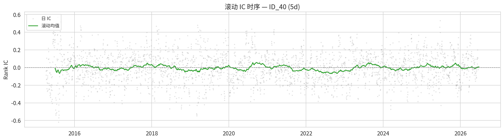

**10d 滚动 IC 时序**

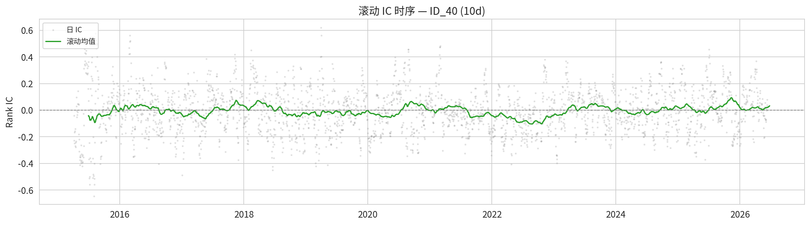

**20d 滚动 IC 时序**

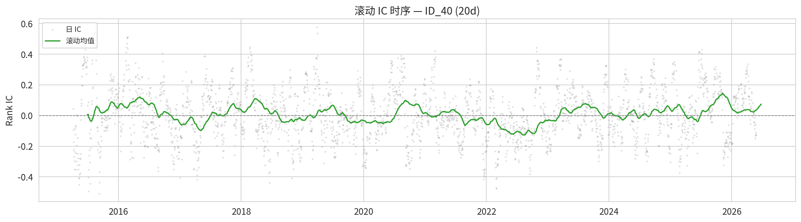

**60d 滚动 IC 时序**

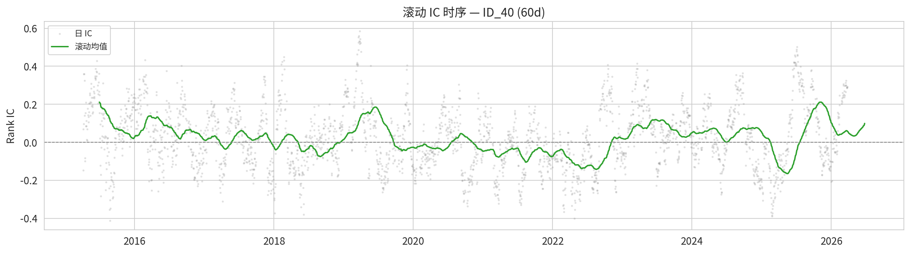

> 滚动 IC 图显示 IC 在不同时间段的表现。IC 均值好看但近几年归零 = 因子已经失效。'IC 在什么时间段有效'比'IC 均值多少'更重要。

### 2.3 IC 衰减曲线

| 持仓期 (天) | IC 均值 | IC 标准差 | IC IR |
|---|---|---|---|
| 5 | -0.004273 | 0.169310 | -0.0252 |
| 10 | -0.005582 | 0.169373 | -0.0330 |
| 20 | 0.009377 | 0.174099 | 0.0539 |
| 60 | 0.020132 | 0.165913 | 0.1213 |

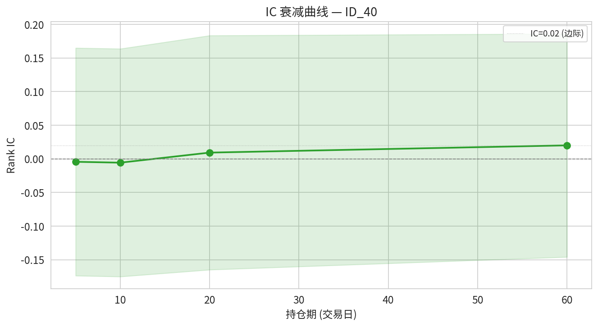

> **怎么算的**: 分别对 T+5/10/20/60 日收益计算 Rank IC，画成衰减曲线。
> **代表什么**: 看 IC 随持仓期延长怎么变化。衰减太快 = 信号太短命（需要高频交易才能抓住）；衰减太慢 = 可能只是捕捉了长期截面特征而非定价错误。好的因子应该有一个合理的半衰期（如 10~20 天衰减到一半）。

## Layer 3: 分组检验

> **本层定位**: 从「因子能否排序」深化到「按因子分组能赚多少钱」。将 IC 的统计显著性转化为可交易的经济显著性。以下各表展示因子值最高组 (Top) 与最低组 (Bottom) 在各持仓期下的表现差异。

### 3.1 各持仓期分位组收益

> 每天把 407 个标的按因子值从低到高分成 5 组，每组等权持有，计算未来 N 日收益的均值。

| 持仓期 | Q1 (Bottom) | Q5 (Top) | Top−Bottom 差值 |
|---|---|---|---|
| 5d | 0.001271 | 0.000910 | -0.000361 |
| 10d | 0.002515 | 0.002394 | -0.000121 |
| 20d | 0.004323 | 0.005969 | 0.001646 |
| 60d | 0.009945 | 0.017670 | 0.007726 |

**5d 分位组收益柱状图**

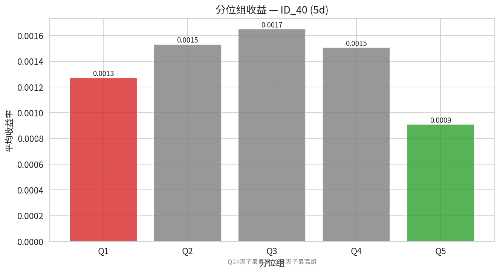

**5d 分位组累计收益**

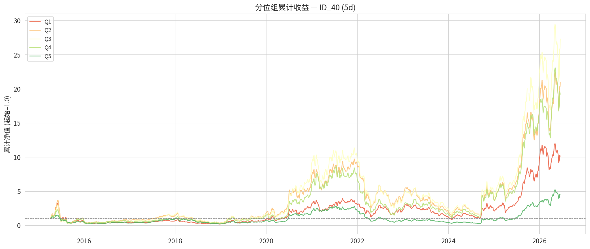

**10d 分位组收益柱状图**

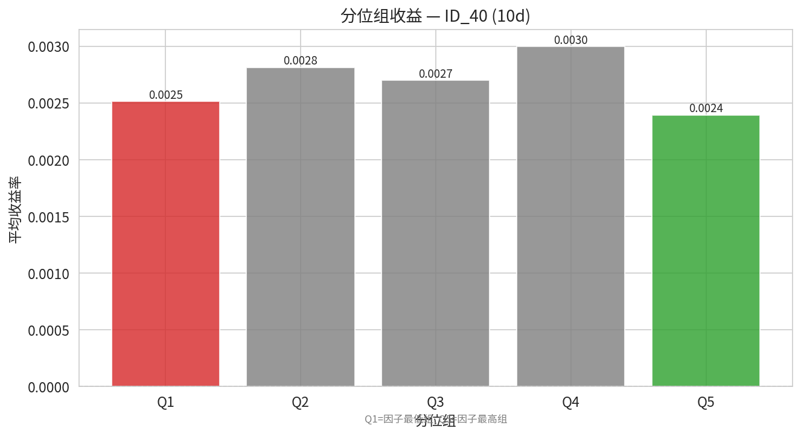

**10d 分位组累计收益**

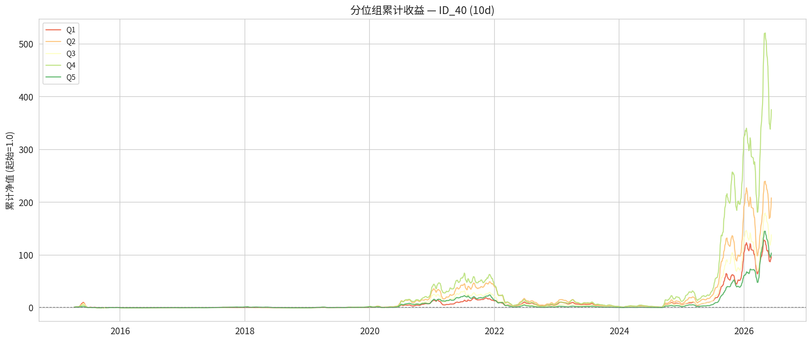

**20d 分位组收益柱状图**

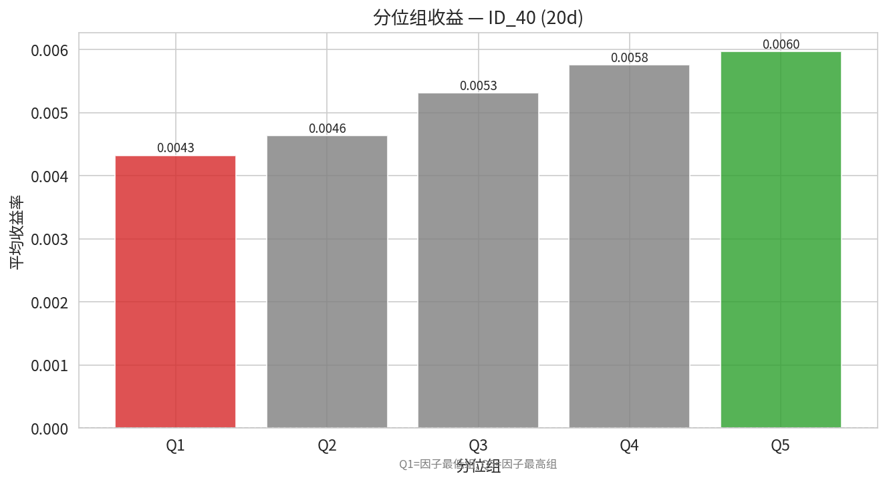

**20d 分位组累计收益**

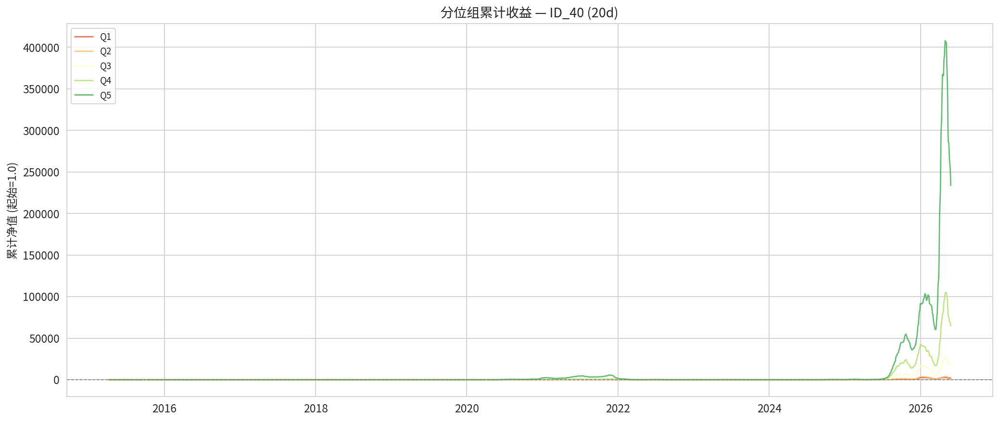

**60d 分位组收益柱状图**

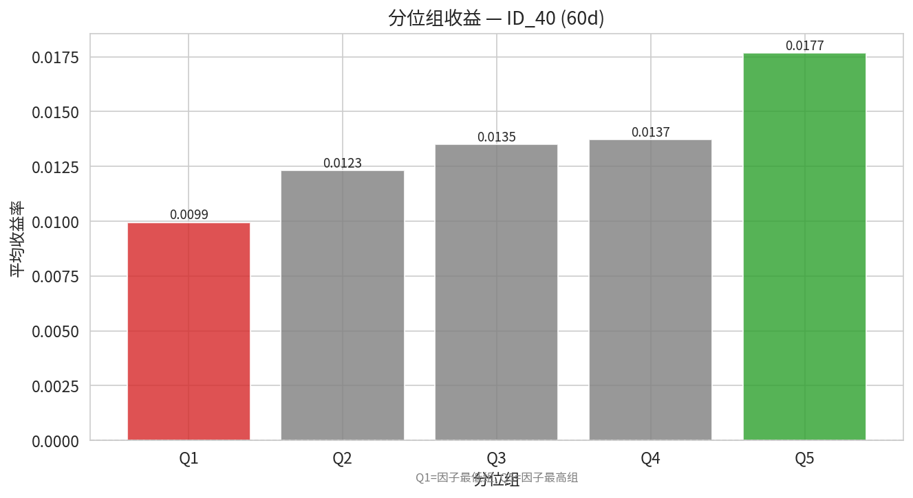

**60d 分位组累计收益**

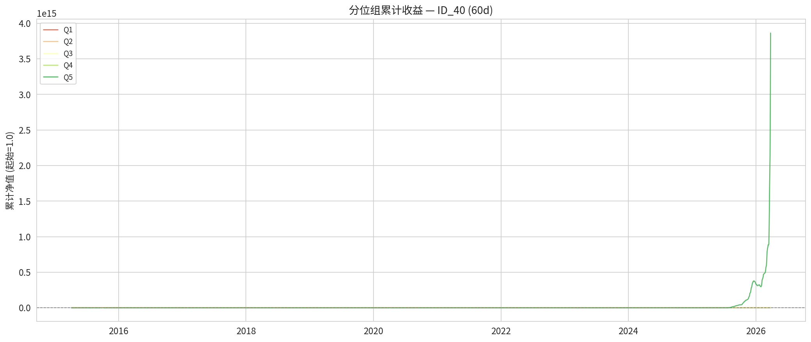

> **代表什么** (以 20d 为例): Top 组（Q5）的收益（0.5969%）明显高于 Bottom 组（Q1）的收益（0.4323%），差值为 0.1646%。因子排序能力较好。
> 理想情况：Q1 > Q2 > Q3 > Q4 > Q5 严格单调（或反过来，看因子方向）。如果中间组有穿插、交叉，说明因子只在极端值有效，中间不可靠。

### 3.2 各持仓期 Long-Short 多空组合

| 持仓期 | 年化收益 | Sharpe | 最大回撤 |
|---|---|---|---|
| 5d | -11.8879% | -0.5114261223022853 | 87.1231% |
| 10d | -11.3124% | -0.35117351632251226 | 95.3374% |
| 20d | 35.0277% | 0.7776257159755026 | 98.9176% |
| 60d | 489.6652% | 6.788507745384011 | 99.9963% |

**5d 多空累计收益曲线**

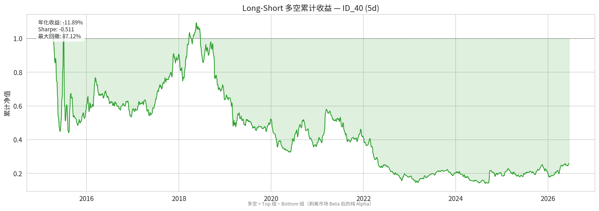

**10d 多空累计收益曲线**

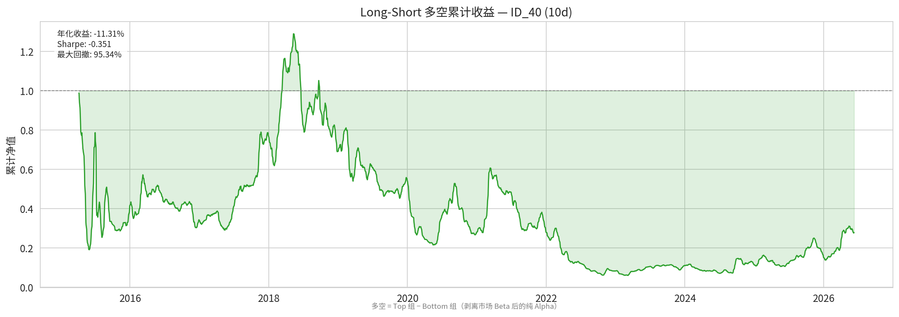

**20d 多空累计收益曲线**

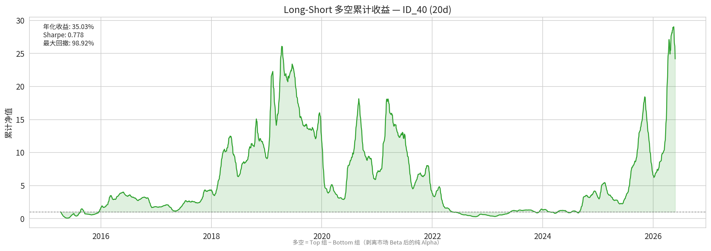

**60d 多空累计收益曲线**

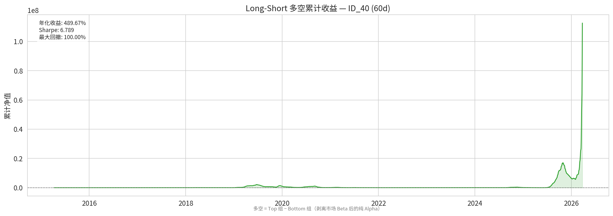

> **怎么算的**: 做多 Top 组 + 做空 Bottom 组，计算这个多空组合的每日收益序列，再算年化收益/波动/Sharpe/最大回撤。
> **代表什么** (以 20d 为例): 多空收益是因子**纯 alpha 的最直接度量**——剥离了市场整体涨跌（beta），只看因子排序本身能不能赚钱。
这个因子的多空年化收益为 +35.0%，说明按因子排序做多最强 + 做空最弱是能赚钱的。
Sharpe = 0.78，收益风险比不错。
最大回撤 = 98.9%（风险很高）。

### 3.4 各持仓期单调性检验

| 持仓期 | 严格单调比例 | 宽松单调比例 | 单调方向 |
|---|---|---|---|
| 5d | 3.50% | 3.50% | decreasing |
| 10d | 3.32% | 3.32% | decreasing |
| 20d | 3.65% | 3.65% | increasing |
| 60d | 3.03% | 3.03% | increasing |

> **怎么算的**: 对每天截面检查 Q1 > Q2 > ... > Qn 是否成立。严格单调 = 每个相邻组都满足大小关系。JT (Jonckheere-Terpstra) 检验评估是否存在统计显著的趋势。
> **代表什么** (以 20d 为例): 严格单调成立仅 3.6%——因子排序非常不稳定，几乎每天的组间收益顺序都不一样。非单调的因子在极端值有效但中间不可靠，做分桶筛选时会有坑。

---

## 综合摘要

| 维度 | 评价 |
|---|---|
| ⚠️ 因子覆盖率仅 47% | 大量缺失，数据质量堪忧 |
| ⚠️ Rank IC (20d) = 0.0094（接近零 | 预测力很弱），IR = 0.054 |
| — | ✅ Long-Short (20d) 年化收益 = 35.0%（优秀） |

---

*报告由 factor_analysis 框架自动生成于 2026-06-28*
