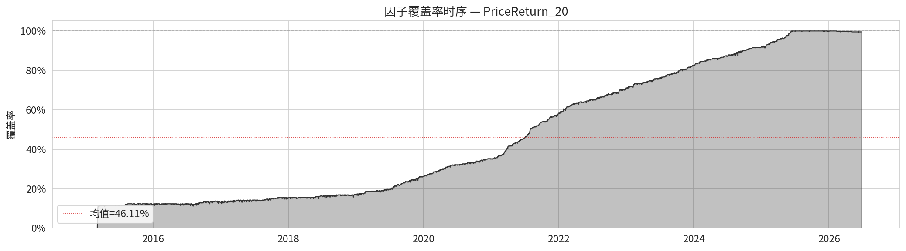
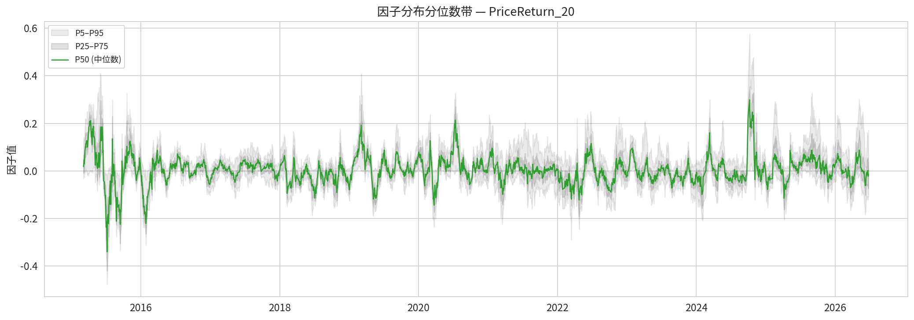
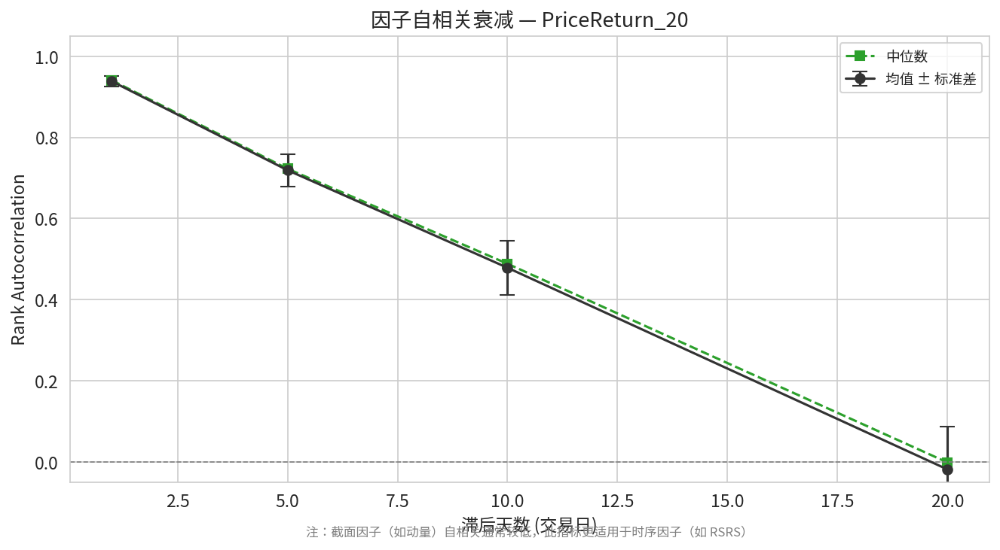
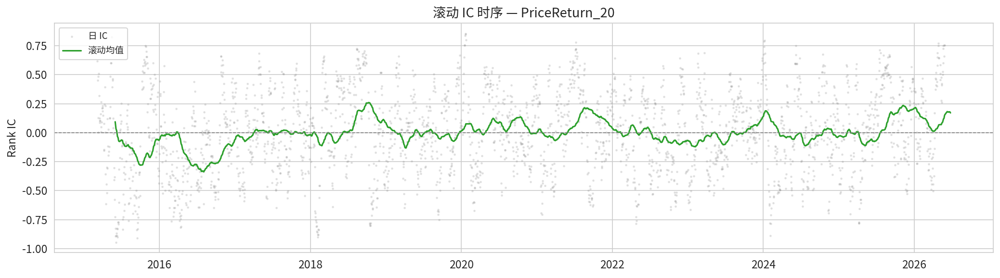
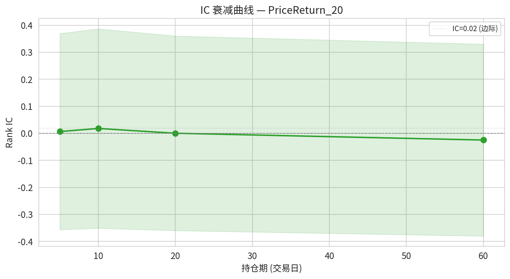
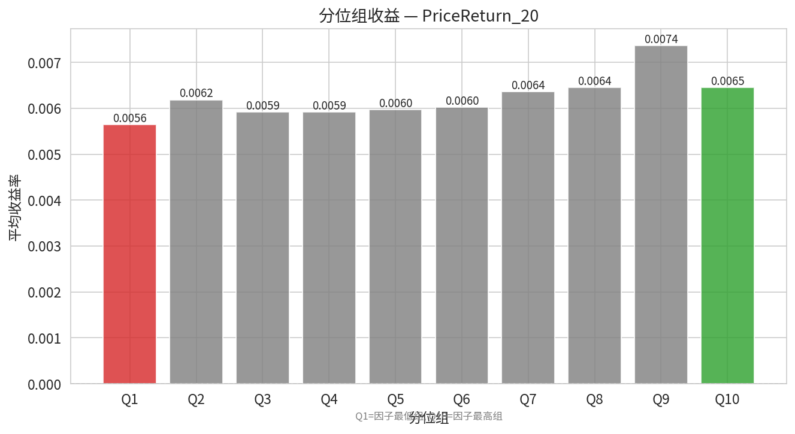
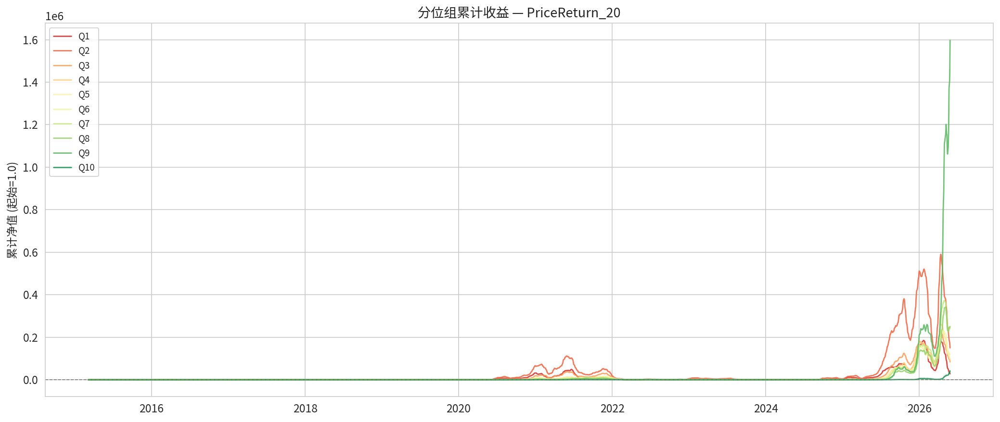
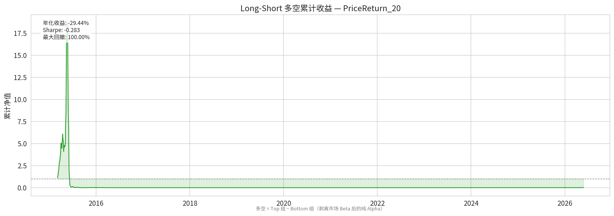

# 因子分析报告: PriceReturn_20

**分析日期**: 2026-06-23 | **因子类型**: PriceReturn

> 本报告评估因子 `PriceReturn_20` 在 419 个标的上（2015-01-30 ~ 2026-06-23）的表现。每个指标均附带「怎么算的」和「代表什么」解读。

## 数据概况

| 项目 | 数值 |
|---|---|
| 有效标的数 | 419 |
| 有效日期数 | 2766 |
| 日期范围 | 2015-01-30 ~ 2026-06-23 |
| 均值覆盖率 | 46.16% |
| 加载失败 | 0 个 |
| min_bars 过滤 | 62 个 |

> **怎么算的**: 均值覆盖率 = 每天有有效因子值的标的数 / 总标的数，再对所有交易日取平均。> 它回答了因子计算有没有系统性缺失——如果某天覆盖率骤降，说明数据源出了 bug 或大量标的进入 warmup 期。

## Layer 1: 因子质量

> **本层定位**: 只看因子自身，不涉及未来收益。回答「这个因子本身是否健康可用」。

### 1.1 覆盖率

> **怎么算的**: 每个交易日统计「有有效因子值的标的数 ÷ 总标的数」，画成时间序列。
> **代表什么**: 覆盖率随时间骤降 = 因子计算有 bug 或数据源退化。覆盖面过窄（如 < 30%）的因子无法做截面比较。

### 1.2 全样本分布统计

| 指标 | 值 |
|---|---|
| mean | 0.007613 |
| std | 0.073754 |
| skewness | 1.056030 |
| kurtosis | 5.453489 |
| min | -0.548458 |
| p01 | -0.156458 |
| p05 | -0.096386 |
| p25 | -0.034171 |
| p50 | 0.002130 |
| p75 | 0.040180 |
| p95 | 0.134180 |
| p99 | 0.246812 |
| max | 1.284274 |

> **怎么算的**: 把所有标的、所有交易日的因子值混在一起，算均值/标准差/偏度/峰度/各分位数。图上是每天截面上的 P5/P25/P50/P75/P95 分位数随时间的变化。
> **代表什么**: 右偏 (skew=1.06)——因子值向正方向拖着长尾巴，少数极端正值（如暴涨）拉高了均值。 峰度=5.45（肥尾）——极端值远多于正态分布预期，因子可能被少数异常值驱动。 P1=-0.1565 到 P99=0.2468 覆盖了 98% 的因子值范围。极端偏态分布的因子不适合用 Pearson IC 评估（Spearman 更健壮）。

### 1.3 缺失模式分析

**按成交额分档**:

| 分档 | 缺失率 |
|---|---|
| 低成交额 | 51.2463% |
| 中成交额 | 56.8332% |
| 高成交额 | 53.4668% |

**按上市时长 (bar_count) 分档**:

| 分档 | 缺失率 |
|---|---|
| 短上市 | 79.2449% |
| 中上市 | 57.8070% |
| 长上市 | 24.5013% |

> **怎么算的**: 按标的的属性（日均成交额 / 有效交易日数）将它们分成 3 档，统计每档内因子 NaN 的比例。
> **代表什么**: 如果缺失率在不同档次间差异很大（如低成交额 ETF 缺失率显著更高），说明因子在截面上系统性地偏向某一类标的，存在隐性偏差。

### 1.4 自相关衰减

| 滞后 (天) | 均值自相关 | 标准差 |
|---|---|---|
| 1 | 0.9382 | 0.0127 |
| 5 | 0.7185 | 0.0400 |
| 10 | 0.4780 | 0.0675 |
| 20 | -0.0206 | 0.1069 |

> **怎么算的**: 对每个标的，计算 factor(t) 和 factor(t−lag) 的 Spearman 秩相关系数，取所有标的的截面均值。
> **代表什么**: lag1=0.94，说明今天的因子值和昨天几乎一样（自相关=94%）。

## Layer 2: 预测力

> **本层定位**: 核心。回答「这个因子能否预测未来收益」——这是评估因子价值最关键的部分。

### 2.1-2.2 IC（信息系数）

| 指标 | Rank IC | Pearson IC |
|---|---|---|
| 均值 | -0.000296 | -0.010264 |
| 标准差 | 0.359439 | 0.351938 |
| IR (mean/std) | -0.000823 | -0.029163 |
| t 统计量 | -0.042945 | -1.522623 |
| IC>0 比例 | 0.504035 | 0.486060 |
| 有效天数 | 2726.000000 | 2726.000000 |

**IC 评级**: ⚪ 接近零 (预测力很弱)

> **怎么算的 (Rank IC)**: 每个交易日，在截面上计算「因子值」与「未来 N 日收益率」的 Spearman 秩相关系数。对所有交易日取均值。
> **代表什么**: Rank IC 均值 = -0.0003，因子值与未来收益的截面排序关系**非常弱**，接近随机。这个因子在这个样本上几乎没有预测力。
> **Rank IC vs Pearson IC**: Rank IC ≈ Pearson IC，说明因子收益不是由少数极端值驱动的，分布较均匀。
> **IR (信息比率)** = IC 均值 ÷ IC 标准差 = -0.0008。IR 衡量的是 IC 的**稳定性**：IR > 0.5 意味着信号噪声比不错，信号比较稳定；IR < 0.2 意味着 IC 波动很大，每天忽正忽负。
> **t 统计量** = -0.04：衡量 IC 均值是否统计上显著不等于 0。绝对值 > 2 通常认为显著。
> **IC>0 比例** = 50.4%：有多少天的 IC 是正数。接近 50% 说明因子方向随机，接近 60% 以上说明方向稳定。

> 滚动 IC 图显示 IC 在不同时间段的表现。IC 均值好看但近几年归零 = 因子已经失效。'IC 在什么时间段有效'比'IC 均值多少'更重要。

### 2.3 IC 衰减曲线

| 持仓期 (天) | IC 均值 | IC 标准差 | IC IR |
|---|---|---|---|
| 5 | 0.006223 | 0.362822 | 0.0172 |
| 10 | 0.017806 | 0.368810 | 0.0483 |
| 20 | -0.000296 | 0.359439 | -0.0008 |
| 60 | -0.024751 | 0.355136 | -0.0697 |

> **怎么算的**: 分别对 T+5/10/20/60 日收益计算 Rank IC，画成衰减曲线。
> **代表什么**: 看 IC 随持仓期延长怎么变化。衰减太快 = 信号太短命（需要高频交易才能抓住）；衰减太慢 = 可能只是捕捉了长期截面特征而非定价错误。好的因子应该有一个合理的半衰期（如 10~20 天衰减到一半）。

## Layer 3: 分组检验

> **本层定位**: 从「因子能否排序」深化到「按因子分组能赚多少钱」。将 IC 的统计显著性转化为可交易的经济显著性。

### 3.1 分位组收益

> 每天把 419 个标的按因子值从低到高分成 10 组，Q1 = 因子值最低的 10%（过去表现最差的），Q10 = 因子值最高的 10%（过去表现最好的）。每组等权持有，计算未来收益的均值。

| 分位组 | 平均收益 | 标准差 | 胜率 |
|---|---|---|---|
| Q1 | 0.005705 | 0.061934 | 54.26% |
| Q2 | 0.006246 | 0.060953 | 53.67% |
| Q3 | 0.005969 | 0.059859 | 53.34% |
| Q4 | 0.005968 | 0.059330 | 53.85% |
| Q5 | 0.005988 | 0.059206 | 54.62% |
| Q6 | 0.006053 | 0.058826 | 54.40% |
| Q7 | 0.006360 | 0.059805 | 55.50% |
| Q8 | 0.006460 | 0.060920 | 54.84% |
| Q9 | 0.007314 | 0.064305 | 55.72% |
| Q10 | 0.006362 | 0.070221 | 55.14% |

> **代表什么**: Top 组和 Bottom 组的收益差异很小，因子无法有效区分"好标的"和"差标的"。
> 理想情况：Q1 > Q2 > Q3 > Q4 > Q5 严格单调（或反过来，看因子方向）。如果中间组有穿插、交叉，说明因子只在极端值有效，中间不可靠。

### 3.2 Long-Short 多空组合

| 指标 | 值 |
|---|---|
| 年化收益 | -31.9003% |
| 年化波动 | 103.7600% |
| Sharpe | -0.3074427079609603 |
| 最大回撤 | 100.0000% |
| 累计收益 | -98.4330% |

> **怎么算的**: 做多 Top 组 + 做空 Bottom 组，计算这个多空组合的每日收益序列，再算年化收益/波动/Sharpe/最大回撤。
> **代表什么**: 多空收益是因子**纯 alpha 的最直接度量**——剥离了市场整体涨跌（beta），只看因子排序本身能不能赚钱。
这个因子的多空年化收益为 -31.9%（负），说明目前的排序方向是亏钱的——可能需要反向使用（做多低因子值 + 做空高因子值）。
Sharpe = -0.31，负收益。
最大回撤 = 100.0%（风险很高）。

### 3.4 单调性检验

- 严格单调成立比例: 0.29%
- 宽松单调成立比例: 0.29%
- 单调方向: decreasing

> **怎么算的**: 对每天截面检查 Q1 > Q2 > ... > Qn 是否成立。严格单调 = 每个相邻组都满足大小关系。JT (Jonckheere-Terpstra) 检验评估是否存在统计显著的趋势。
> **代表什么**: 严格单调成立仅 0.3%——因子排序非常不稳定，几乎每天的组间收益顺序都不一样。非单调的因子在极端值有效但中间不可靠，做分桶筛选时会有坑。

---

## 综合摘要

| 维度 | 评价 |
|---|---|
| ⚠️ 因子覆盖率仅 46% | 大量缺失，数据质量堪忧 |
| ⚠️ Rank IC = -0.0003（接近零 | 预测力很弱），IR = -0.001 |
| — | 🔴 Long-Short 年化收益 = -31.9%（负值） |

---

*报告由 factor_analysis 框架自动生成于 2026-06-23*
