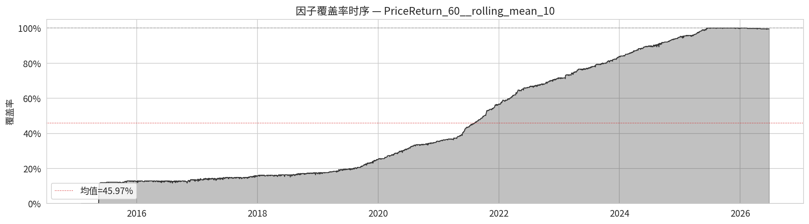
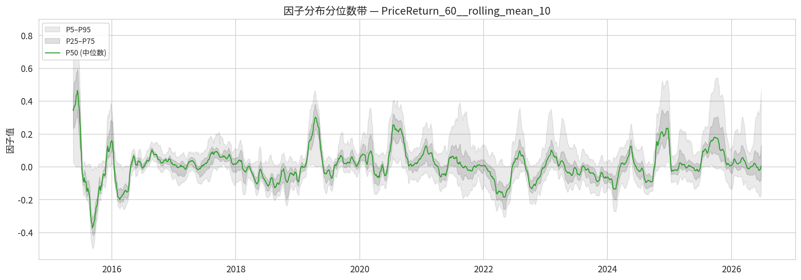
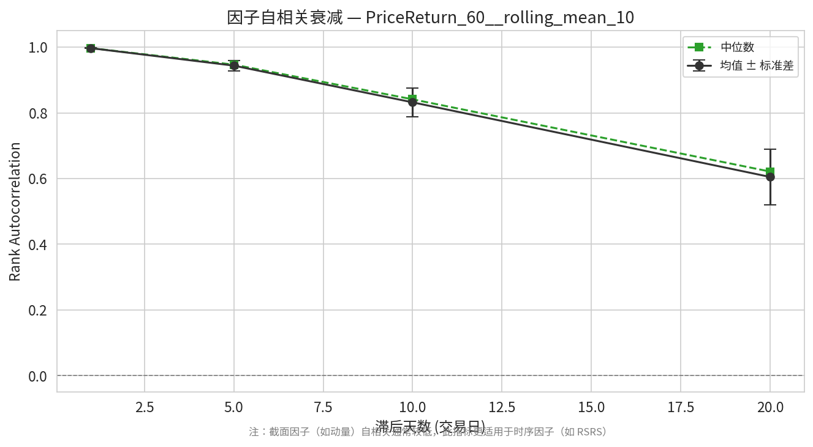
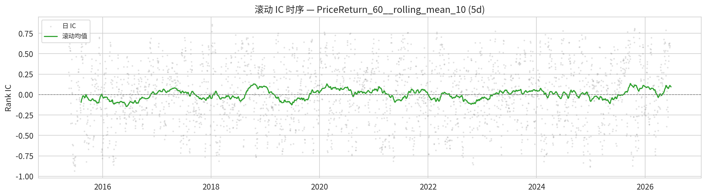
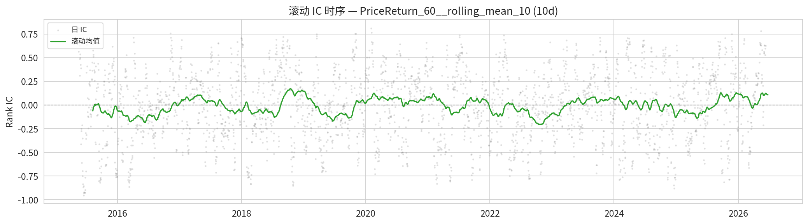
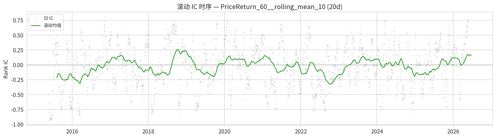
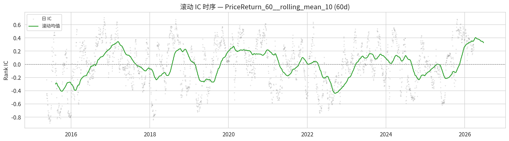
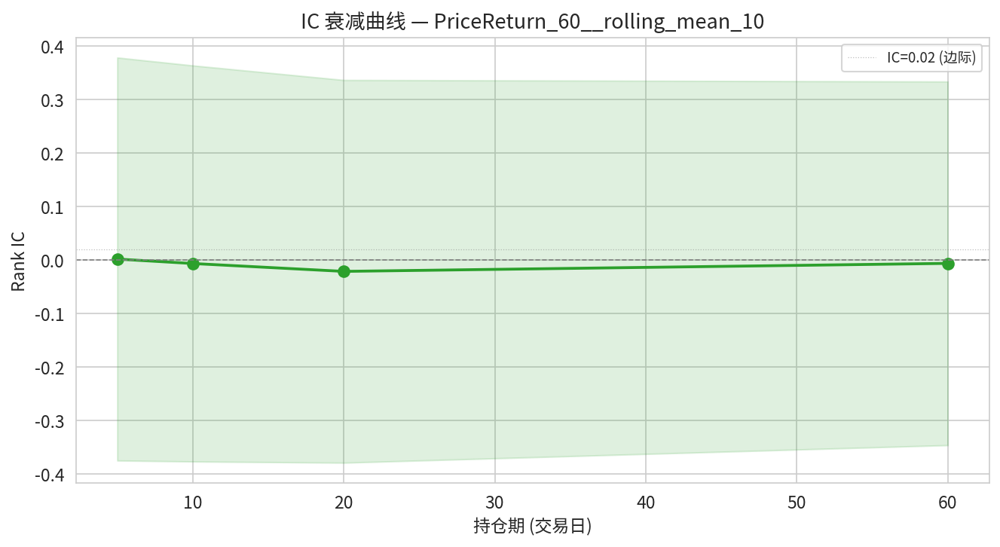

# 因子分析报告: PriceReturn_60__rolling_mean_10

**分析日期**: 2026-06-30 | **因子类型**: TransformFactor

> 本报告评估因子 `PriceReturn_60__rolling_mean_10` 在 402 个标的上（2015-01-30 ~ 2026-06-25）的表现。每个指标均附带「怎么算的」和「代表什么」解读。

## 数据概况

| 项目 | 数值 |
|---|---|
| 有效标的数 | 402 |
| 有效日期数 | 2768 |
| 日期范围 | 2015-01-30 ~ 2026-06-25 |
| 均值覆盖率 | 45.97% |
| 加载失败 | 0 个 |
| min_bars 过滤 | 79 个 |

> **怎么算的**: 均值覆盖率 = 每天有有效因子值的标的数 / 总标的数，再对所有交易日取平均。> 它回答了因子计算有没有系统性缺失——如果某天覆盖率骤降，说明数据源出了 bug 或大量标的进入 warmup 期。

## Layer 1: 因子质量

> **本层定位**: 只看因子自身，不涉及未来收益。回答「这个因子本身是否健康可用」。

### 1.1 覆盖率

> **怎么算的**: 每个交易日统计「有有效因子值的标的数 ÷ 总标的数」，画成时间序列。
> **代表什么**: 覆盖率随时间骤降 = 因子计算有 bug 或数据源退化。覆盖面过窄（如 < 30%）的因子无法做截面比较。

### 1.2 全样本分布统计

| 指标 | 值 |
|---|---|
| mean | 0.021698 |
| std | 0.123088 |
| skewness | 1.114313 |
| kurtosis | 3.667127 |
| min | -0.581736 |
| p01 | -0.223745 |
| p05 | -0.147959 |
| p25 | -0.052775 |
| p50 | 0.008292 |
| p75 | 0.074750 |
| p95 | 0.250816 |
| p99 | 0.424804 |
| max | 1.498822 |

> **怎么算的**: 把所有标的、所有交易日的因子值混在一起，算均值/标准差/偏度/峰度/各分位数。图上是每天截面上的 P5/P25/P50/P75/P95 分位数随时间的变化。
> **代表什么**: 右偏 (skew=1.11)——因子值向正方向拖着长尾巴，少数极端正值（如暴涨）拉高了均值。 峰度=3.67（肥尾）——极端值远多于正态分布预期，因子可能被少数异常值驱动。 P1=-0.2237 到 P99=0.4248 覆盖了 98% 的因子值范围。极端偏态分布的因子不适合用 Pearson IC 评估（Spearman 更健壮）。

### 1.3 缺失模式分析

**按成交额分档**:

| 分档 | 缺失率 |
|---|---|
| 低成交额 | 51.2286% |
| 中成交额 | 57.0629% |
| 高成交额 | 53.7985% |

**按上市时长 (bar_count) 分档**:

| 分档 | 缺失率 |
|---|---|
| 短上市 | 78.3903% |
| 中上市 | 58.5179% |
| 长上市 | 25.1817% |

> **怎么算的**: 按标的的属性（日均成交额 / 有效交易日数）将它们分成 3 档，统计每档内因子 NaN 的比例。
> **代表什么**: 如果缺失率在不同档次间差异很大（如低成交额 ETF 缺失率显著更高），说明因子在截面上系统性地偏向某一类标的，存在隐性偏差。

### 1.4 自相关衰减

| 滞后 (天) | 均值自相关 | 中位数自相关 | 标准差 |
|---|---|---|---|
| 1 | 0.9970 | 0.9972 | 0.0010 |
| 5 | 0.9438 | 0.9468 | 0.0159 |
| 10 | 0.8320 | 0.8412 | 0.0433 |
| 20 | 0.6047 | 0.6212 | 0.0855 |

> **怎么算的**: 对每个标的，计算 factor(t) 和 factor(t−lag) 的 Spearman 秩相关系数，取所有标的的截面均值和中位数。中位数比均值更稳健，不受少数极端标的影响。
> **代表什么**: lag1 中位数=1.00，说明一半以上标的今天的因子值和昨天几乎一样（自相关=100%）。 lag20=0.62，即使隔一个月仍有62%相关性——因子变化缓慢，调仓频率不需要太高（如日频调仓意义不大，周频或月频更合理）。

## Layer 2: 预测力

> **本层定位**: 核心。回答「这个因子能否预测未来收益」——这是评估因子价值最关键的部分。

### 2.1 各持仓期 IC

| 持仓期 | Rank IC 均值 | IR | t 统计量 | IC>0 比例 | Pearson IC 均值 |
|---|---|---|---|---|---|
| 5d | 0.001664 | 0.0044 | 0.23 | 50.6% | -0.003195 |
| 10d | -0.006649 | -0.0180 | -0.93 | 50.9% | -0.014008 |
| 20d | -0.021347 | -0.0597 | -3.09 | 48.6% | -0.029787 |
| 60d | -0.006387 | -0.0188 | -0.97 | 52.2% | -0.014228 |

**IC 评级** (以 20d 为例): 🔵 负向（与预期方向相反）

> **怎么算的 (Rank IC)**: 每个交易日，在截面上计算「因子值」与「未来 N 日收益率」的 Spearman 秩相关系数。对所有交易日取均值。
> **代表什么**: （以 20d 为例）Rank IC 均值 = -0.0213，因子值与未来收益**负相关**——因子值越高，未来收益反而越低。可能是反转因子，或者你预期的方向反了。
> **Rank IC vs Pearson IC** (20d): Rank IC ≈ Pearson IC，说明因子收益不是由少数极端值驱动的，分布较均匀。
> **IR (信息比率)** = IC 均值 ÷ IC 标准差 = -0.0597。IR 衡量的是 IC 的**稳定性**：IR > 0.5 意味着信号噪声比不错，信号比较稳定；IR < 0.2 意味着 IC 波动很大，每天忽正忽负。
> **t 统计量** = -3.09：衡量 IC 均值是否统计上显著不等于 0。绝对值 > 2 通常认为显著。
> **IC>0 比例** = 48.6%：有多少天的 IC 是正数。接近 50% 说明因子方向随机，接近 60% 以上说明方向稳定。

**5d 滚动 IC 时序**

**10d 滚动 IC 时序**

**20d 滚动 IC 时序**

**60d 滚动 IC 时序**

> 滚动 IC 图显示 IC 在不同时间段的表现。IC 均值好看但近几年归零 = 因子已经失效。'IC 在什么时间段有效'比'IC 均值多少'更重要。

### 2.3 IC 衰减曲线

| 持仓期 (天) | IC 均值 | IC 标准差 | IC IR |
|---|---|---|---|
| 5 | 0.001664 | 0.376616 | 0.0044 |
| 10 | -0.006649 | 0.370132 | -0.0180 |
| 20 | -0.021347 | 0.357679 | -0.0597 |
| 60 | -0.006387 | 0.339872 | -0.0188 |

> **怎么算的**: 分别对 T+5/10/20/60 日收益计算 Rank IC，画成衰减曲线。
> **代表什么**: 看 IC 随持仓期延长怎么变化。衰减太快 = 信号太短命（需要高频交易才能抓住）；衰减太慢 = 可能只是捕捉了长期截面特征而非定价错误。好的因子应该有一个合理的半衰期（如 10~20 天衰减到一半）。

---

## 综合摘要

| 维度 | 评价 |
|---|---|
| ⚠️ 因子覆盖率仅 46% | 大量缺失，数据质量堪忧 |
| 🔴 Rank IC (20d) = -0.0213（负值 | 方向与预期相反），IR = -0.060 |

---

*报告由 factor_analysis 框架自动生成于 2026-06-30*
